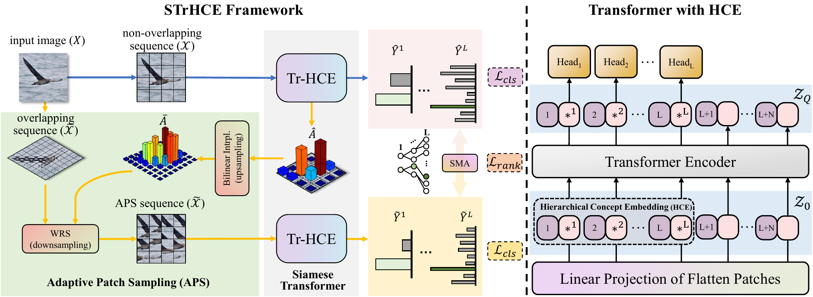

# Siamese Transformer with Hierarchical Concept Embedding for Fine-Grained Image Recognition

This is the official implementation of Siamese Transformer with Hierarchical Concept Embedding (STrHCE).

> It is a challenging task to distinguish the subtle differences among fine-grained images from subordinate concepts,
> where the subconcepts are usually from a concept hierarchy. In this paper, we propose a Siamese Transformer with
> Hierarchical Concept Embedding (STrHCE), which contains two transformer subnetworks sharing all configurations and
> each
> is equipped with encoding the hierarchical semantic information at different concept levels into fine-grained image
> embeddings. Concretely, one subnetwork is for coarse-scale patches to learn the discriminative regions with the aid of
> the innate multi-head self-attention mechanism of transformer. The other is for finer-scale patches (which are
> adaptively sampled from the discriminative regions) to capture subtle yet discriminative visual cues and eliminate
> redundant information. STrHCE connects two subnetworks via a score margin adjustor to enforce the most discriminative
> regions generating more confident predictions. Extensive experiments have been conducted on four commonly-used
> benchmark
> datasets including CUB-200- 2011, FGVC-Aircraft, Stanford Dogs and NABirds, and empirically demonstrate the
> superiority
> of the proposed STrHCE by comparing with the state-of-the-art baselines.



## Requirement

The code is tested on:

- pytorch==1.8.0
- torchvision==0.7.0
- timm==0.4.5

Use `pip` or `conda` to install all dependencies:

```shell
pip install -r requirements.txt
```

or

```shell
conda install --file requirements.txt
```

## Usage

Run the following command to train the model used in the paper:

```bash
DATASET="cub2011"
python train.py cub2011hier2 \
  --datadir="dataset/$DATASET" \
  --logdir="results/$DATASET/strhce" \
  --arch=vit_deit_small_distilled_patch16_224 \
  --epoch=100 \
  --batch-size=8 \
  --lr=1e-3 \
  --lr-step=30 \
  --lr-policy=step \
  --wd=1e-4 \
  --print-freq=100 \
  --worker=4 \
  --pretrained \
  --seed=0 \
  --use-amp \
  --ngpus=2 \
  --dist-url="tcp://127.0.0.1:10001" \
  --multiprocessing-distributed \
  --world-size=1 \
  --rank=0 \
  --concept-level=3
```

The dataset will be automatically downloaded and prepared in `./datasets` when first run.
After preparing the dataset, please move the file in `datasets/hierarchy/` to
the corresponding dataset directory.

